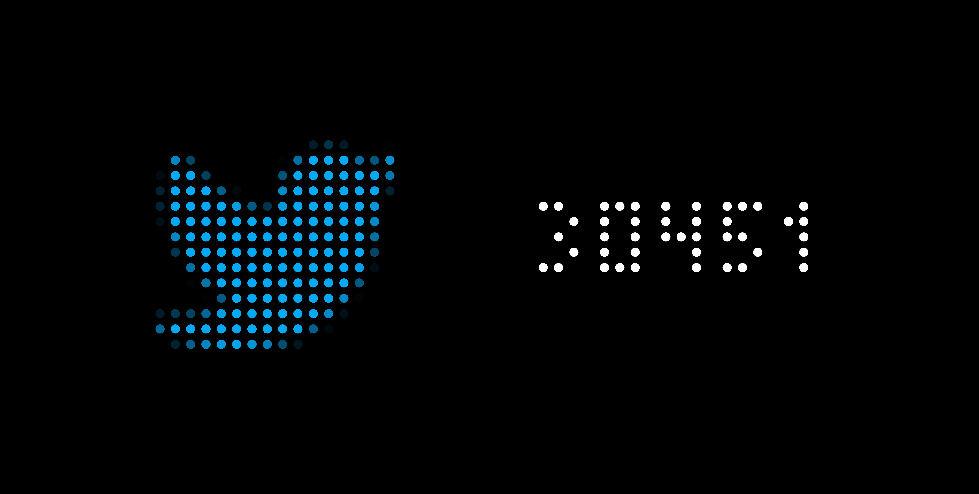
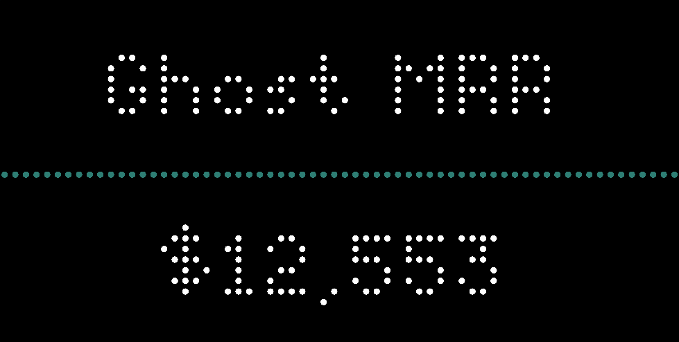
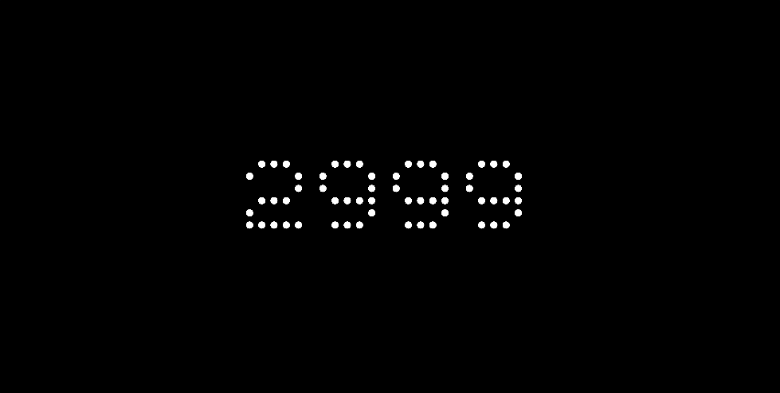

# The Tracker

### Flexible TidByt counter to display your data via a tolta.co tracker ID.

## Show social & ecom numbers

Twitter, YouTube, Ghost, Chart Mogul, Gumroad, Paddle, and Clubhouse.

Create your account and tracker at https://tolta.co/ and use your tracker ID.

Instagram has not been working on tolta.co for some time. Sorry! Nothing I can do about that. The logo looks sexy so I kept it.

Note that tolta.co refreshes data every 30 minutes.

## Flexible layout, number formatting, colors, icons, and font

## Site - Feature - Status

### Twitter
Followers - working

### Instagram
Followers - NOT working

### YouTube
Followers - working

Views - working

### Ghost
Total Members - working

Free Members - working

Paying Members - working

MRR - working 

### Chart Mogul
MRR - working

ARR - working

ARPU - working

MRR churn % - working (won't show % sign)

Customers - working

### Gumroad
Needs testing

### Paddle
Needs testing

### Clubhouse
Needs testing

## Ongoing

Happy to add any additonal icons! Most I am using are 16px, very few are 12px. Feel free to send me your desired icon in PNG or Base64.

Twitter politely asks to not use their icon in any setting smaller than 16px, so a smaller Twitter icon is off the table.

If you want to find your own icon, I suggest icons8.com's Tiny Color collection: https://icons8.com/icons/tiny-color. These are all 16px pixel perfect icons.

Happy to add addional colors too! Send me a hex color code, a color name of your choosing, and a lymrick please :)
